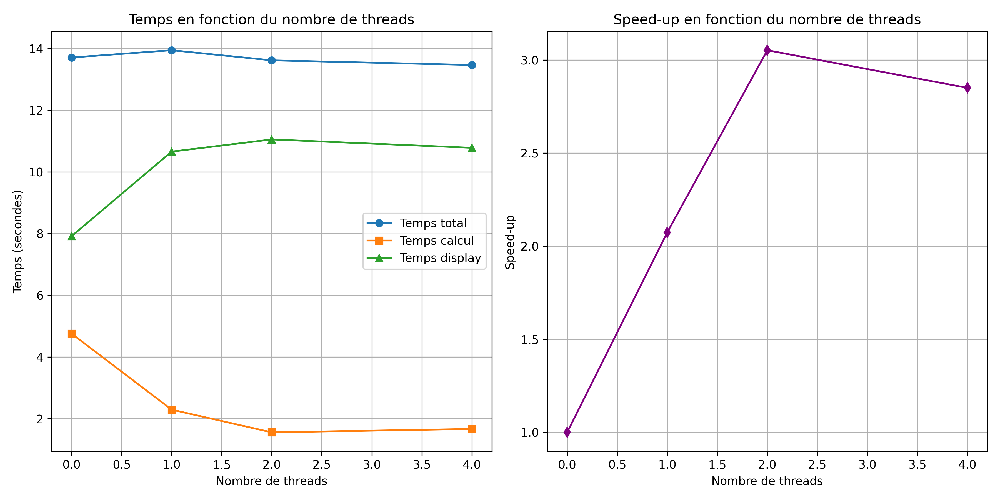
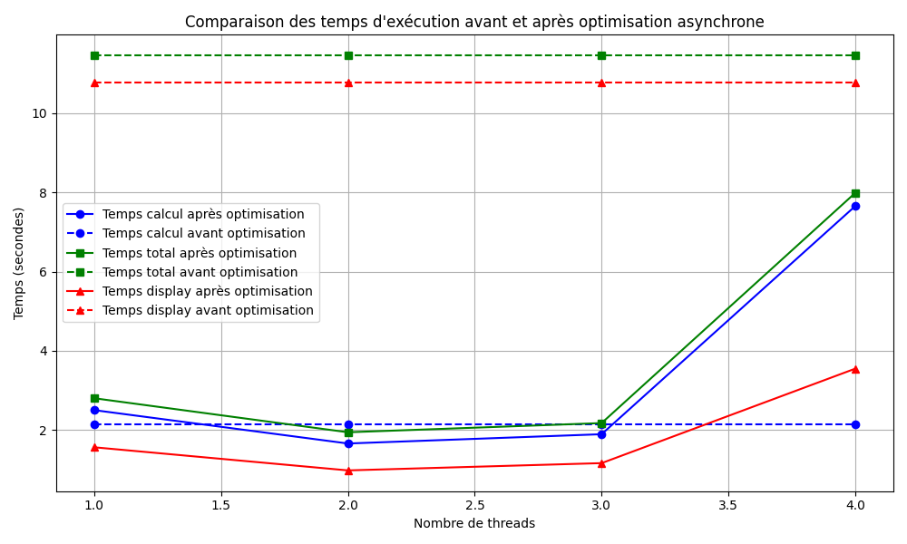

# Auriane Martel

# Compte-rendu du projet OS202

Utilisation des LLM : j'ai utilisé chatGPT comme documentation générale (comme moteur de recherche), pour le code de dump et celui de création de courbes.

## Étape 1

```
$ lscpu
...
Identifiant constructeur :                  GenuineIntel
  Nom de modèle :                           Intel(R) Core(TM) i5-3340M CPU @ 2.70GHz
    Famille de processeur :                 6
    Modèle :                                58
    Thread(s) par cœur :                    2
    Cœur(s) par socket :                    2
    Socket(s) :                             1
...
Caches (sum of all):                        
  L1d:                                      64 KiB (2 instances)
  L1i:                                      64 KiB (2 instances)
  L2:                                       512 KiB (2 instances)
  L3:                                       3 MiB (1 instance)
```

Pour cette étape, j'ai transformé le front de feu d'une unorderded map en un vecteur d'index m_fire_front_v.
Je lui ajoute les index de zones en feu au fur et à mesure, et supprime les zones éteintes lors d'un filtrage final à la copie du vecteur.

La parallélisation en OpenMP est mise en place aux deux boucles for de propagation de feu et diminution de la végétation.

J'ai cherché à mettre en place l'environnement parallèle en dehors de la boucle while principale, mais je n'ai pas réussi à gérer l'OpenMP lors du passage dans la fonction de simulation. Le code actuel est donc la version fonctionnelle, mais sous-optimale, où l'environnement parallèle se met en place lors des boucle for.


Mesure          | Séquentiel |  1 thread  | 2 threads | 4 threads |
----------------|------------|------------|-----------|-----------|
Temps total     |  13.7092s  |  13.9446s  |  13.6174s |  13.4666s |
Temps calcul    |  4.75898s  |  2.29557s  |  1.5594s  |  1.67008s |
Temps display   |  7.9162s   |  10.6573s  |  11.0523s |  10.7809s |



Le speed-up est calculé sur les temps de calcul. On remarque que le temps total est très peu impacté par la parallélisation, à cause du temps important pris par l'affichage. En revanche, le temps de calcul est bien réduit, en particulier à deux thread, ce qui correspond bien à l'architecture de mon processeur. 

J'ai ajouté une méthode à Model permettant de sauver les cartes de végétation et de feu sur un fichier séparé, ce que j'ai mis en place à intervalles réguliers pour le code séquentiel et le code parallélisé. Les cartes obtenues sont différentes d'environ 10% au début (255 et 512 pas pour n = 200), mais la différence se réduit quand la simulation avance. Ce type de comportement est présent entre parallèle et séquentiel et entre codes parallèles de nombres de threads différents. Ces erreurs pourraient être dues à des erreurs dans des calculs de flottants lors des tirages au sort de propagation et d'extinction du feu.

## Étape 2

Pour séparer la partie affichage de la partie calcul, il a fallu ajouter de la communication :
- transmission des cartes calculées pour l'affichage
- information de fin (ou non) de transmission pour que l'affichage s'arrête à la fin de la transmission

J'obtiens les temps suivants, pour n=200: 
- Temps calcul : 4.52241 secondes
- Temps total : 11.0711 secondes
- Temps display : 10.4424 secondes

Le temps total est réduit, même par rapport au code parallélisé en OpenMP, et avec un temps de calcul similaire au séquentiel : on voit à nouveau l'impact du temps d'affichage sur le temps total.

## Étape 3

J'ai d'abord réuni les avancées des étapes 1 et 2. Comme attendu, cela a amélioré le temps de calcul mais le temps global est resté similaire à celui de l'étape 2.

J'ai ensuite optimisé ce programme, en désynchronisant l'affichage et le calcul: quand le process d'affichage a fini d'afficher, il envoie un message au process parallélisé de calcul, qui envoie en retour l'état courant du terrain.

| Temps | Avant optimisation | Après optimisation (1 threads) | Après optimisation (2 threads) | Après optimisation (3 threads) | Après optimisation (4 threads) |
|---|---|---|---|---|---|
| Calcul | 2.13842 | 2.50098 | 1.65843 | 1.89308 | 7.65524 |
| Total | 11.4663 | 2.80132 | 1.94176 | 2.17403 | 7.98798 |
| Display | 10.7736 | 1.56285 | 0.979191 | 1.16284 | 3.54902 |



On constate une nette amélioration des différents temps par rapport aux étapes précédentes, en particulier pour deux threads. Par contre, la performance se dégrade lorqu'on dépasse le nombre de coeurs logiques au total (4+1).

En calculant en continu, on affiche moins de configurations, donc le temps d'affichage et donc le temps total sont très fortement réduits.


## Étape 4

La quatrième étape était dédiée à une parallélisation en MPI du calcul, avec une décomposition des cartes sur les différents process. Il aurait fallu alors utiliser la méthode de cellules fantomes, pour les deux cartes. Je comptais décomposer les cartes par groupes de lignes (facile à gérer avec le format de l'index), les process consécutifs partageant alors deux lignes. Je n'ai pas eu le temps de le réaliser.


