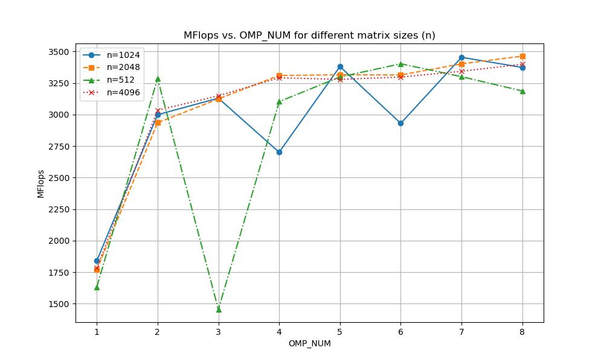
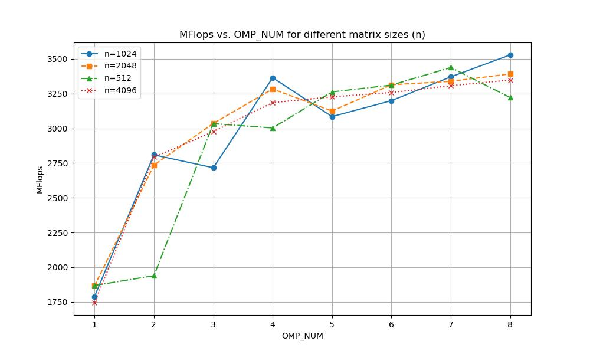
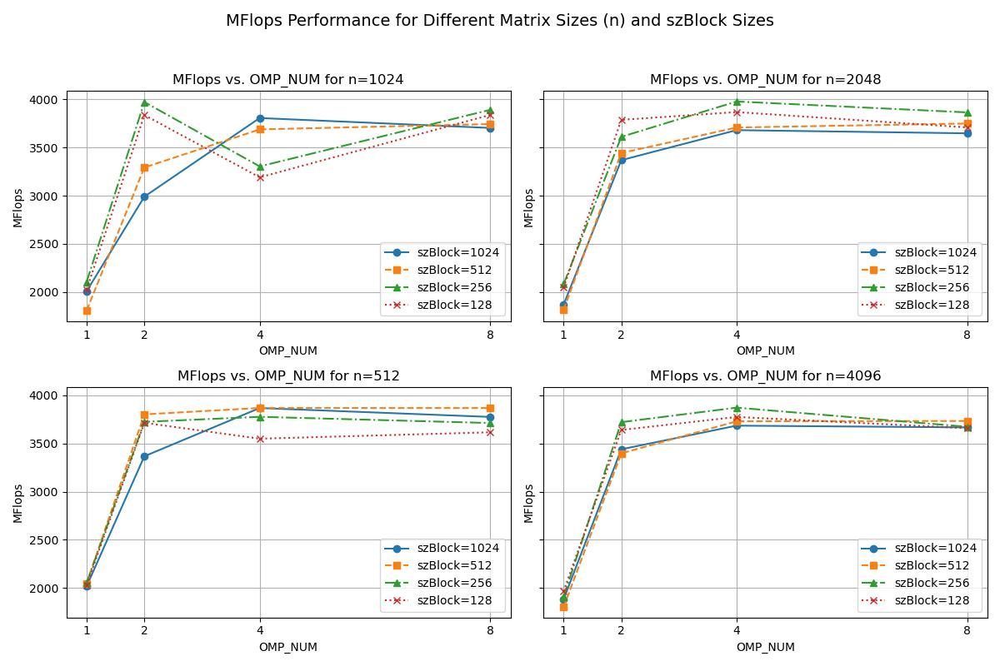

# TD1

`pandoc -s --toc README.md --css=./github-pandoc.css -o README.html`

## lscpu

*lscpu donne des infos utiles sur le processeur : nb core, taille de cache :*

```
Processeur(s) :                         4
Thread(s) par cœur :                    2
Cœur(s) par socket :                    2
Socket:                                 1

Donc 2 coeurs réellement, qui en hyperthreading donnent 4 threads parallèles.

Caches (sum of all):                        
  L1d:                                      64 KiB (2 instances)
  L1i:                                      64 KiB (2 instances)
  L2:                                       512 KiB (2 instances)
  L3:                                       3 MiB (1 instance)
```

## Partie 1 : Produit matrice-matrice

### Effet de la taille de la matrice

  n            | MFlops
---------------|--------
1024 (origine) |111
1023           |115
1025           |115

L'alignement de la taille de la matrice avec la longueur des blocs de cache peut engendrer des pertes d'efficacité de la gestion du cache. En effet, les lignes de caches sont organisées en sets, et le choix du set pour une case mémoire est déterminé par un modulo sur une puissance de deux. Si la matrice est d'une taille puissance de deux, quand j'itère sur une des dimensions d'une matrice, je n'ai accès qu'à certains de ces sets. C'est une limitation artificielle de la taille de mon cache, donc je dois accéder à ma mémoire RAM plus souvent.

Cela n'est pas flagrant sur mon ordinateur, peut-être que mon processeur intègre des mécanismes de gestion de cache "intelligent" qui réduisent ces pertes d'efficacité, du type prefetch intelligent.


### Permutation des boucles

*Expliquer comment est compilé le code (ligne de make ou de gcc) : on aura besoin de savoir l'optim, les paramètres, etc. Par exemple :*

`make TestProduct.exe && ./TestProduct.exe 1024`


  ordre           | time    | MFlops  | MFlops(n=2048)
------------------|---------|---------|----------------
i,k,j (origine)   | 19.6741 | 109.153 | 85.5885
i,j,k             | 8.57384 | 250.469 | 191.796
j,i,k             | 8.82752 | 243.272 | 190.058
j,k,i             | 0.896604| 2395.13 | 2419.98
k,i,j             | 18.9484 | 113.333 | 86.7403
k,j,i             | 1.05376 | 2037.92 | 2023.19


Les matrices sont rangées dans la mémoire par colonnes. C'est l'indice le plus à l'intérieur qui bouge le plus souvent. i concerne les colonnes de A et de C, le calcul est donc plus efficace quand i est au centre (j,k,i et k,j,i), puisqu'on maximise l'usage du cache pour les deux matrices à la fois. À l'inverse, le calcul est beaucoup moins efficace quand j est au centre, puisqu'en itérant sur les lignes on ne fait pas usage du cache et on accède à chaque fois à la mémoire RAM.

NB : La différence entre les tests en 1024 et 2048 peut être due à d'autres événements, comme un changement de fenêtre pour noter les réponses.


### OMP sur la meilleure boucle

`make TestProduct.exe && OMP_NUM_THREADS=8 ./TestProduct.exe 1024`

J'ai fait tourner les calculs deux fois pour améliorer la fiabilité des résultats.

  OMP_NUM         | MFlops  | MFlops(n=2048) | MFlops(n=512)  | MFlops(n=4096)
------------------|---------|----------------|----------------|---------------
1                 | 1840.44 | 1769.42        | 1631.12        | 1782.36
2                 | 2999.26 | 2935.47        | 3287.55        | 3035.05
3                 | 3130.12 | 3124.28        | 1454.48        | 3149.01
4                 | 2701.39 | 3310.24        | 3102.82        | 3292.18
5                 | 3381.29 | 3315.47        | 3298.26        | 3279.02
6                 | 2930.58 | 3314.35        | 3402.97        | 3297.57
7                 | 3454.28 | 3402.34        | 3300.57        | 3343.62
8                 | 3373.64 | 3463.7         | 3187.48        | 3399.2




  OMP_NUM         | MFlops  | MFlops(n=2048) | MFlops(n=512)  | MFlops(n=4096)
------------------|---------|----------------|----------------|---------------
1                 | 1789.59 | 1866.56        | 1868.86        | 1745.08
2                 | 2809.43 | 2735.33        | 1939.28        | 2792.64
3                 | 2716.26 | 3035.49        | 3033.78        | 2976.46
4                 | 3364.56 | 3283.31        | 3003.24        | 3185.23
5                 | 3084.71 | 3124.86        | 3262.53        | 3226.81
6                 | 3199.67 | 3313.94        | 3311.39        | 3258.23
7                 | 3370.68 | 3338.62        | 3437.97        | 3307.09
8                 | 3528.89 | 3391.87        | 3221.35        | 3347.77




On voit que pour les 4 cas, le parallélisme améliore la vitesse de calcul : l'efficacité augmente fortement jusqu'à 4 threads, puis elle reste globalement stable entre 4 et 8 threads.

1.4 : L'accéleration due à la parallélisation est limitée par l'accès en mémoire, et cet accès en mémoire n'est pas encore complètement utilisé. Il faudrait organiser les calculs pour qu'ils utilisent au maximum le cache disponible avant de le modifier en accédant à la mémoire RAM.

### Produit par blocs

`make TestProduct.exe && ./TestProduct.exe 1024`

  szBlock         | MFlops  | MFlops(n=2048) | MFlops(n=512)  | MFlops(n=4096)
------------------|---------|----------------|----------------|---------------
origine (=4096)   | 2322.19 | 2488.82        | 2765.75        | 2387.66
32                | 2465.22 | 2373.83        | 2391.21        | 2300.81
64                | 2257.89 | 2239.47        | 2193.91        | 2136.79
128               | 2534.99 | 2571.12        | 2469.65        | 2436.67
256               | 2592.07 | 2732.97        | 2630.09        | 2331.32
512               | 2365.07 | 2346.36        | 2767.9         | 2349
1024              | 2478.92 | 2301.5         | 2553.46        | 2336.54


On observe globalement peu d'amélioration en séquentiel par rapport au calcul sans blocks (origine). On peut supposer que le facteur limitant est ici le temps de calcul du processeur. On peut tout de même observer une légère amélioration pour szBlock=128 ou 256.


### Bloc + OMP

  szBlock      | OMP_NUM | MFlops  | MFlops(n=2048) | MFlops(n=512)  | MFlops(n=4096)|
---------------|---------|---------|----------------|----------------|---------------|
1024           |  1      | 2009.26 | 1868.78        | 2018.31        | 1882.1        |
1024           |  2      | 2989.19 | 3368.09        | 3366.47        | 3438.61       |
1024           |  4      | 3805.23 | 3679.67        | 3866.95        | 3684.3        |
1024           |  8      | 3702.36 | 3646.61        | 3774.61        | 3666.21       |
512            |  1      | 1809.59 | 1816.55        | 2048.59        | 1802.6        |
512            |  2      | 3292.16 | 3442.19        | 3801.31        | 3396.5        |
512            |  4      | 3687.35 | 3706.96        | 3867.5         | 3729.47       |
512            |  8      | 3742.68 | 3748.59        | 3866.78        | 3732.73       |
256            |  1      | 2105.94 | 2080.55        | 2053.34        | 1908.38       |
256            |  2      | 3971.44 | 3610           | 3723.38        | 3720.51       |
256            |  4      | 3303.29 | 3976.73        | 3775.78        | 3870.94       |
256            |  8      | 3890.75 | 3863.7         | 3711.48        | 3672.22       |
128            |  1      | 2025.56 | 2046.62        | 2030.66        | 1966.6        |
128            |  2      | 3836.3  | 3786.41        | 3713.75        | 3639.35       |
128            |  4      | 3189.98 | 3867.11        | 3548.92        | 3774.33       |
128            |  8      | 3837.83 | 3707.77        | 3615.42        | 3657.45       |



Le parallélisme améliore la performance, fortement entre 1 et 2 threads, et pour certains n entre 2 et 4 threads, puis le résultat reste stable entre 4 et 8 threads. La performance est globlament meilleure pour des blocs de taille 256 ou 128, sauf pour n=512, où il semblerait que traiter les matrices en un bloc marche mieux (elles tiennent pratiquement dans le cache L3).


### Comparaison avec BLAS, Eigen et numpy

blas :

n     |  MFlops  |
------|----------|
1024  | 2093.22  |
2048  | 2115.59  |
512   | 2436.86  |
4096  | 2300.44  |

La performance est nettement moins bonne que pour le programme ajusté spécifiquement à mon ordinateur.

# Tips

```
	env
	OMP_NUM_THREADS=4 ./produitMatriceMatrice.exe
```

```
    $ for i in $(seq 1 4); do elap=$(OMP_NUM_THREADS=$i ./TestProductOmp.exe|grep "Temps CPU"|cut -d " " -f 7); echo -e "$i\t$elap"; done > timers.out
```


## Partie 2 : MPI

### Jeton

```
make jeton.exe
mpirun -np 4 --host localhost:4 ./jeton.exe 
```

Affiche : 
```
Le jeton vaut 4
```


